# System Architecture

```mermaid
---
title: Decentralized Credit Verification System - Architecture
---
flowchart TB
    subgraph Actors["External Actors"]
        Bank["🏦 Partner Bank<br/>(KYC/AML Authority)"]
        Borrower["👤 Borrower<br/>(Identity Owner)"]
        Lender["🏢 Lender<br/>(Data Requester)"]
        Admin["⚙️ Administrator"]
    end

    subgraph Blockchain["⛓️ Ethereum Blockchain (On-Chain)"]
        subgraph Contracts["Smart Contracts"]
            CM["📋 ConsentManager<br/>─────────────────<br/>• grantConsent()<br/>• revokeConsentById()<br/>• revokeAllConsents()<br/>• checkConsent()<br/>• isConsentValid()"]

            CR["🪪 CreditRegistry<br/>─────────────────<br/>• registerIdentityAttributes()<br/>• updateIdentityAttributes()<br/>• getIdentityAttributes()<br/>• getAccountReferenceHash()"]

            AL["📜 AuditLog<br/>─────────────────<br/>• logEvent()<br/>• getAuditEntry()<br/>• getAccessHistory()<br/>• authorizeLogger()"]
        end

        subgraph OnChainData["On-Chain Data Storage"]
            ConsentStore[("Consent Mapping<br/>─────────────────<br/>consentId → Consent{<br/>  borrower, lender,<br/>  scopes[], expiry,<br/>  isRevoked<br/>}")]

            IdentityStore[("Identity Mapping<br/>─────────────────<br/>address → {<br/>  userId,<br/>  emailHash,<br/>  creditTier,<br/>  incomeBracket,<br/>  debtRatioBracket<br/>}")]

            AuditStore[("Audit Entries<br/>─────────────────<br/>AuditEntry[]<br/>• accessor, subject<br/>• scope, timestamp<br/>• eventType")]
        end
    end

    subgraph OffChain["🔐 Off-Chain Infrastructure"]
        OCS["🗄️ OffChainStore (Python)<br/>─────────────────────<br/>• register_record()<br/>• fetch(lender, borrower, scope)<br/>─────────────────────<br/>Stores: Raw Financial Data<br/>(credit scores, income, debt)"]

        EncryptedDB[("🔒 Encrypted Data Store<br/>─────────────────<br/>Raw Financial Records<br/>• Credit Scores<br/>• Income Details<br/>• Debt Ratios")]
    end

    %% Contract Interactions
    CR -->|"references"| CM
    CR -->|"logs events"| AL
    CM -->|"stores"| ConsentStore
    CR -->|"stores"| IdentityStore
    AL -->|"stores"| AuditStore

    %% Off-chain connections
    OCS -->|"queries consent"| CM
    OCS -->|"stores/retrieves"| EncryptedDB

    %% Admin flows
    Admin -->|"deploy & configure"| Contracts
    Admin -->|"authorizeLogger()"| AL

    %% Bank Registration Workflow
    Bank -.->|"1. KYC/AML Verification"| Borrower
    Bank -->|"2. registerIdentityAttributes()<br/>(pseudonym, hashes, tiers)"| CR

    %% Borrower flows
    Borrower -->|"grantConsent(lender, scopes, duration)"| CM
    Borrower -->|"revokeAllConsents(lender)"| CM
    Borrower -->|"revokeConsentById(consentId)"| CM
    Borrower -->|"updateIdentityAttributes()"| CR

    %% Lender flows
    Lender -->|"1. Request Data"| OCS
    OCS -->|"2. checkConsent(borrower, scope)"| CM
    CM -->|"3. Return valid/invalid"| OCS
    OCS -->|"4. Return encrypted data<br/>(only if valid)"| Lender
    Lender -->|"getIdentityAttributes()<br/>(public tiers only)"| CR

    %% Styling
    classDef contract fill:#3498db,stroke:#2980b9,color:#fff
    classDef actor fill:#2ecc71,stroke:#27ae60,color:#fff
    classDef storage fill:#9b59b6,stroke:#8e44ad,color:#fff
    classDef offchain fill:#e74c3c,stroke:#c0392b,color:#fff

    class CM,CR,AL contract
    class Bank,Borrower,Lender,Admin actor
    class ConsentStore,IdentityStore,AuditStore storage
    class OCS,EncryptedDB offchain
```

---

# Workflow Sequence Diagrams

## 1. Bank-Verified User Registration

```mermaid
sequenceDiagram
    autonumber
    participant Bank as 🏦 Partner Bank
    participant Borrower as 👤 Borrower
    participant CR as 📋 CreditRegistry
    participant AL as 📜 AuditLog

    Bank->>Borrower: Complete KYC/AML & Patrimony Verification
    Bank->>Bank: Prepare pseudonymous ID (hash of bank ID)
    Bank->>CR: registerIdentityAttributes(emailHash, creditTier, incomeBracket, debtRatioBracket, accountRefHash)

    CR->>CR: Validate inputs (non-zero hashes, non-empty tiers)
    CR->>CR: Create IdentityAttributes struct
    CR->>CR: Store identity mapping & accountReferenceHash
    CR->>AL: logEvent(IDENTITY_REGISTERED)
    AL-->>CR: ✓ Logged
    CR->>CR: Emit IdentityAttributesRegistered event
    CR-->>Bank: ✓ Registration Complete

    Bank-->>Borrower: Notify: Identity Active on Platform
```

## 2. Consent Grant Workflow

```mermaid
sequenceDiagram
    autonumber
    participant Borrower as 👤 Borrower
    participant CM as 📋 ConsentManager

    Borrower->>CM: grantConsent(lender, scopes[], durationSeconds)

    CM->>CM: Validate lender address ≠ 0
    CM->>CM: Validate scopes[] not empty
    CM->>CM: Validate duration > 0

    CM->>CM: Calculate expiryBlockTime = now + duration
    CM->>CM: Generate consentId = keccak256(borrower, lender, scopes, timestamp, block)

    CM->>CM: Create Consent struct {<br/>  borrower, lender, scopes[],<br/>  startBlockTime, expiryBlockTime,<br/>  isRevoked: false<br/>}

    CM->>CM: Store: consents[consentId] = Consent
    CM->>CM: Store: borrowerConsents[borrower].push(consentId)
    CM->>CM: Emit ConsentGranted event

    CM-->>Borrower: Return consentId
```

## 3. Data Fetch with Consent Check

```mermaid
sequenceDiagram
    autonumber
    participant Lender as 🏢 Lender
    participant OCS as 🗄️ OffChainStore
    participant CM as 📋 ConsentManager
    participant DB as 🔒 Encrypted DB

    Lender->>OCS: fetch(lender, borrower, scope)

    OCS->>CM: checkConsent(borrower, scope)<br/>[called from lender's context]

    CM->>CM: Iterate borrowerConsents[borrower]

    loop For each consentId
        CM->>CM: Check: consent.lender == msg.sender (lender)?
        CM->>CM: Check: consent.isRevoked == false?
        CM->>CM: Check: block.timestamp ≤ expiryBlockTime?
        CM->>CM: Check: scope in consent.scopes[]?
    end

    alt Valid Consent Found
        CM->>CM: Emit ConsentQueried(consentId, lender, true)
        CM-->>OCS: Return true
        OCS->>DB: Retrieve record for (borrower, scope)
        DB-->>OCS: Raw financial data
        OCS-->>Lender: Return encrypted payload
    else No Valid Consent
        CM->>CM: Emit ConsentQueried(null, lender, false)
        CM-->>OCS: Return false
        OCS-->>Lender: Return null (access denied)
    end
```

## 4. Consent Revocation Workflow

```mermaid
sequenceDiagram
    autonumber
    participant Borrower as 👤 Borrower
    participant CM as 📋 ConsentManager

    alt Revoke Single Consent
        Borrower->>CM: revokeConsentById(consentId)
        CM->>CM: Validate: consent.borrower == msg.sender
        CM->>CM: Validate: consent.isRevoked == false
        CM->>CM: Set consent.isRevoked = true
        CM->>CM: Emit ConsentRevoked(consentId, borrower, lender)
        CM-->>Borrower: ✓ Consent Revoked
    else Revoke All Consents to Lender
        Borrower->>CM: revokeAllConsents(lender)
        CM->>CM: Iterate borrowerConsents[msg.sender]
        loop For each consentId
            CM->>CM: If consent.lender == lender && !isRevoked
            CM->>CM: Set consent.isRevoked = true
            CM->>CM: Emit ConsentRevoked event
        end
        CM-->>Borrower: ✓ All Consents to Lender Revoked
    end

    Note over CM: Subsequent checkConsent() calls<br/>for revoked consents return false
```

---

## Data Flow Summary

